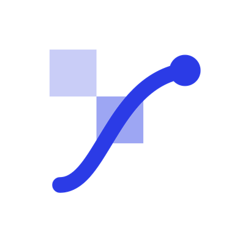
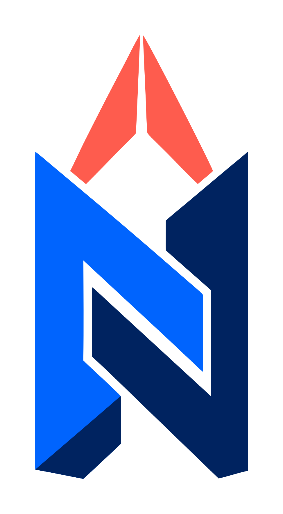
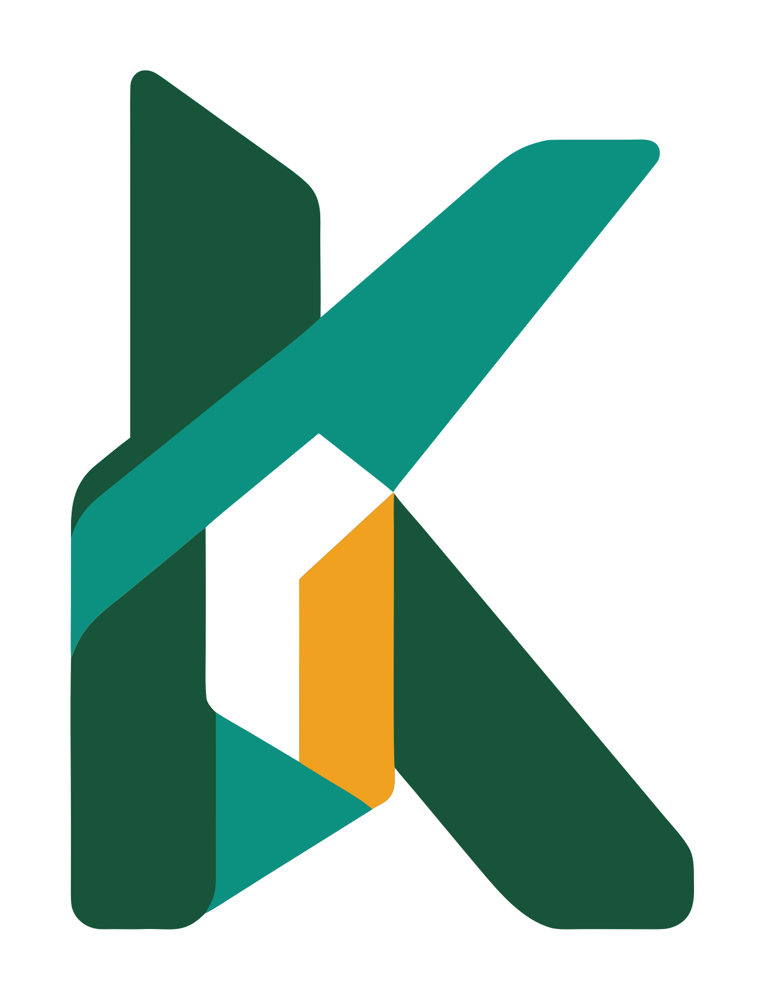

<p align="center">
  
</p>

<h1 align="center">CleanVector MCP Server</h1>

<p align="center">
  Generate professional logos and editable SVG artwork, or vectorize any image, from your AI agent.
</p>

<p align="center">
  <a href="https://cleanvector.ai/mcp">Docs</a> ·
  <a href="https://cleanvector.ai/app/api-keys">Get an API key</a> ·
  <a href="https://registry.modelcontextprotocol.io/v0/servers?search=cleanvector">MCP Registry</a> ·
  <a href="https://cleanvector.ai/gallery">Gallery</a>
</p>

---

CleanVector is a hosted [Model Context Protocol](https://modelcontextprotocol.io) server. It gives Claude Code, Cursor, VS Code, Windsurf and any other MCP client three things most image tools cannot return to an agent:

- **Professional logos.** One brief in, a full brand kit out: the logo as editable SVG, black and white variants, transparent PNG exports and a color palette measured from the finished mark.
- **Production-ready SVG.** Illustrations, icons, stickers and mascots as real vector paths with a transparent background. No embedded bitmaps, no white rectangle behind the art.
- **Clean vectorization.** Turn a PNG, JPG or WebP, including AI-generated images, into an SVG you can recolor and scale.

Nothing to install or run. The server is remote, speaks Streamable HTTP and is listed in the official MCP Registry as `ai.cleanvector/cleanvector`.

## Examples

These three logos were generated from a one-sentence brief each. They are the actual SVG files, stored in [`examples/`](examples).

<table>
  <tr>
    <td align="center"><br><sub><b>Northstar</b><br>An interlocking N and compass for a strategy studio</sub></td>
    <td align="center"><br><sub><b>Kinfold</b><br>A folded ribbon K for a community platform</sub></td>
    <td align="center"><br><sub><b>Halo</b><br>Two orbital loops forming an H for a spatial computing studio</sub></td>
  </tr>
</table>

What you can ask your agent once it is connected:

> Design a logo for "Northstar", a strategy studio. Geometric, confident, deep blue with one coral accent. Save the SVG and the black and white variants into `./brand`.

> Generate six matching flat line icons for a fitness app as SVG and put them in `public/icons`.

> Vectorize `./mockups/hero.png` and replace the raster in the landing page with the SVG.

## Quick start

1. Create an API key at [cleanvector.ai/app/api-keys](https://cleanvector.ai/app/api-keys). API and MCP access is included in the Plus and Pro plans.
2. Add the server to your client.

**Claude Code**

```bash
claude mcp add --transport http cleanvector https://cleanvector.ai/api/mcp \
  --header "Authorization: Bearer cv_YOUR_KEY"
```

**Cursor** (`~/.cursor/mcp.json`)

```json
{
  "mcpServers": {
    "cleanvector": {
      "url": "https://cleanvector.ai/api/mcp",
      "headers": {
        "Authorization": "Bearer cv_YOUR_KEY"
      }
    }
  }
}
```

**VS Code** (`.vscode/mcp.json`)

```json
{
  "inputs": [
    {
      "id": "cleanvector_key",
      "type": "promptString",
      "description": "CleanVector API key",
      "password": true
    }
  ],
  "servers": {
    "cleanvector": {
      "type": "http",
      "url": "https://cleanvector.ai/api/mcp",
      "headers": {
        "Authorization": "Bearer ${input:cleanvector_key}"
      }
    }
  }
}
```

**Windsurf** (`~/.codeium/windsurf/mcp_config.json`)

```json
{
  "mcpServers": {
    "cleanvector": {
      "serverUrl": "https://cleanvector.ai/api/mcp",
      "headers": {
        "Authorization": "Bearer cv_YOUR_KEY"
      }
    }
  }
}
```

**Claude Desktop and other stdio-only clients** (through [`mcp-remote`](https://www.npmjs.com/package/mcp-remote))

```json
{
  "mcpServers": {
    "cleanvector": {
      "command": "npx",
      "args": [
        "-y",
        "mcp-remote",
        "https://cleanvector.ai/api/mcp",
        "--header",
        "Authorization:${CLEANVECTOR_AUTH}"
      ],
      "env": {
        "CLEANVECTOR_AUTH": "Bearer cv_YOUR_KEY"
      }
    }
  }
}
```

## Tools

| Tool | What it does | Cost |
| --- | --- | --- |
| `generate_logo` | Generate a professional vector logo with original, black and white variants, PNG exports and a measured palette. Accepts a reference image to refine an existing identity or to use as loose inspiration. | 8 credits |
| `generate_illustration` | Generate an editable SVG illustration, icon, sticker or mascot scene from a text prompt. Pass a `mascot_id` to keep one character consistent across scenes. | 4 credits |
| `vectorize_image` | Convert a PNG, JPG or WebP (up to 5 MB, by URL or base64) into a clean, editable SVG. | 1 or 4 credits |
| `wait_for_task` | Wait for an asynchronous task to settle and return its result. | free |
| `get_task` | Fetch the status of one task, including download URLs once it succeeds. | free |
| `list_tasks` | List the account's most recent tasks. | free |
| `list_mascots` | List saved mascots whose ids keep a character consistent. | free |
| `download_svg` | Return finished artwork as SVG markup. | free |
| `download_png` | Return finished artwork as a PNG image in the agent's context, at any width. | free |
| `download_logo_kit` | Return three SVGs, three PNGs and `palette.json` as a ZIP. | free |
| `get_account` | Return the current plan and credit balance. | free |

Generation is asynchronous. A typical flow is `generate_logo`, then `wait_for_task`, then `download_logo_kit`. Downloads and re-exports never cost credits.

## Details

| | |
| --- | --- |
| Endpoint | `https://cleanvector.ai/api/mcp` |
| Transport | Streamable HTTP |
| Authentication | `Authorization: Bearer cv_...` API key |
| Registry name | `ai.cleanvector/cleanvector` |
| Access | Plus and Pro plans |
| REST API | The same key works with the REST API, documented in the [dashboard](https://cleanvector.ai/app/api-keys) |

The registry manifest is in [`server.json`](server.json).

## What the output looks like

Every result is standard SVG: plain `<path>` elements with fills, no embedded images, no scripts and a transparent canvas. It opens and edits in Figma, Illustrator, Inkscape and the free [CleanVector SVG editor](https://cleanvector.ai/svg-editor). Read [how CleanVector works](https://cleanvector.ai/methodology) for what to check before using an asset in production.

AI-generated logos do not come with trademark clearance. Search the relevant trademark databases before relying on a mark commercially.

## Support

- Documentation: [cleanvector.ai/mcp](https://cleanvector.ai/mcp)
- Contact: [cleanvector.ai/contact](https://cleanvector.ai/contact)
- Issues with these docs or the client configs: open an issue in this repository.

## License

The documentation, configuration examples and example artwork in this repository are released under the [MIT License](LICENSE). The CleanVector service itself is a hosted commercial product.
